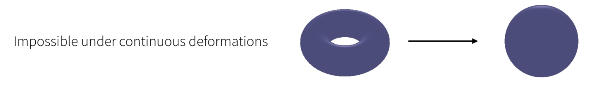
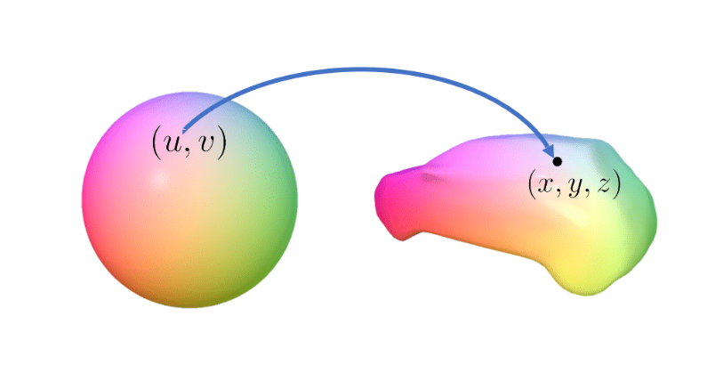

There are several ways in which objects can be represented in 3D. Before we dive in to the actual details of how a computer looks at 3D objects, let us first try to see if we can derive any intuition from how the real world operates.

In the real world, animals and humans use sensing oragans called eyes (duh!) to see the world. The eye allows light that bounces off from different object to travel through a small hole which causes an inverted image to form on the retina (back of the eye). This is how objects are "rendered" when organisms sense the world.
  

This is almost exactly how a camera works too! A small hole (aperture) allows a little bit of all of the light to go through and form an image on a screen.

  

## Modelling Objects

In the real world, matter can be though of as a continuous mass that is composed of individual point particles. This is the simplest representation of an object in 3D space that can easily be formatted in a manner a computer can understand (point clouds).

### Point Clouds

Point clouds are essentially "points" that are presented in 3D space. Each point is treated as a small sphere that has a 3D location $(x, y, z)$ associated with it.

 

A given 3D object can be represented by $N$ points in a point cloud. 

$$
\left\{\mathbf{p}_1, \mathbf{p}_2, \cdots, \mathbf{p}_N\right\}
$$

Something important to note about point clouds is that they are permutation invariant. It doesn't matter if you put point $p_1$ after point $p_{50}$. They represent the same object. This is important since only permuatation invariant algorithms can work on point cloud representations of objects.

An issue with the point cloud representation is that any sense of "surface"/"volume" is lost. As the individual point particles simply exist in 3D space, we cannot establish a continuum for particles that may exist beneath the object, and a representation of surface can arise only when the density of points is very large. i.e., there is no notion of "connectivity".

Thus, to abate this issue, point clouds are often represented with an orientation. Since we know the orientation of any given point, the points themselves can be approximated as small flat discs instead of a sphere. This is especially useful for rendering purposes.

  
 

Now that we have an understanding of point clouds, let us take a look at surface representations of objects called Meshes.

### Meshes

Meshes comprise of two key pieces of information - 1) Vertices that represent the rough shape of the object (could be a point cloud) and 2) Faces that are formed by a combination of vertices in a particular order.

  

The above GIF shows a cow being rendered as a mesh. It looks very smooth!

Faces are treated as flat objects that exist as connections between given vertices. For example, a square could be formed between vertices [0, 3, 4, 1]. It is important to note that the order is very important when using meshes. Furthermore, when representing polygons with more than 3 vertices, it is very easy to get non-planar representations of a single surface, where the true reconstruction of the surface may not be trivial and can depend on the geometries of points that do not exist as part of the surface making reconstruction ambiguous.

!!expand!!

To solve both these problems, the rendering and vision community has restricted faces to be "triangular" surfaces. Not only is the order of vertices no longer relevant, surfaces formed by a single face is always guaranteed to be planar!

!!add image!!

Note that in mesh representations, it is impossible to change the underlying topology of the object unless connections are broken.

  

### Parametric Surfaces

While the previous two representations are direct representations of the underlying 3D structure of an object, parametric surfaces are an indirect way of representing objects in 3D space.

A parametric surface is defined in terms of a function, where changing the parameters of the function 
within a given domain can give rise to points on the surface.

$$
f(\mathbf{u})=\mathbf{p} \in \mathbb{R}^2 ; \  mathbf{u} \in \mathbb{S}^1
$$

Hint: Does this representation remind you of a neural network parameterized by theta?

Such functions essentially serve as mappings from a given surface to another surface.

  

